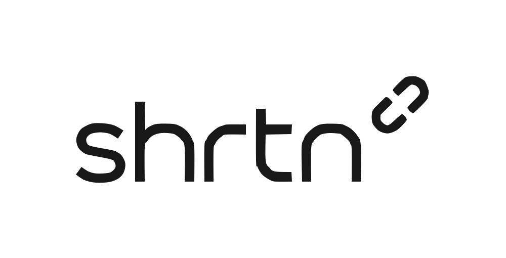

<p align="center">
  
</p>

<p align="center">
  A high-performance, full-stack URL shortener and traffic intelligence platform built with Spring Boot, React, and Go WebAssembly on Cloudflare Edge.
</p>

<p align="center">
  <a href="https://app.shrtn.fun"></a>
  <a href="https://shrtn.fun"></a>
  <a href="https://github.com/CharanMunur/shrtn"></a>
</p>

<p align="center">
  
  
  
  
  
  
  
</p>

---

## Overview

Shrtn is an enterprise-grade URL shortening and traffic intelligence engine. It combines a low-latency **Go (Golang) WebAssembly Edge Redirect Engine** running across Cloudflare's global network with a **Spring Boot 4 REST API** and a **React 19 Dashboard**.

Designed for high availability, short links resolve at Cloudflare Edge Isolates in under 20 milliseconds by querying Upstash Redis REST endpoints directly, with non-blocking asynchronous click analytics logging to PostgreSQL and automatic fallbacks.

---

## Architecture & Directory Layout

The repository is structured as a monorepo containing three primary services:

| Component | Path | Description | Deployment |
|---|---|---|---|
| **Client** | [`/client`](./client) | React 19, TypeScript, Vite, Tailwind CSS v4, shadcn UI components, Recharts analytics, Framer Motion transitions | Vercel (`app.shrtn.fun`) |
| **Server** | [`/server`](./server) | Java 25, Spring Boot 4 REST API, Spring Data JPA, JWT Authentication, Resend API integration, Gradle frontend sync | Render (`shrtn.fun`) |
| **Worker** | [`/cloudflare-worker`](./cloudflare-worker) | Go 1.22 compiled to WebAssembly (`main.wasm`), sub-20ms edge redirects, Upstash REST client, Edge static asset caching | Cloudflare Workers |

---

## Core Capabilities

### 1. Edge Redirection Engine (Go / WebAssembly)
- **Sub-20ms Latency**: Executes at Cloudflare's nearest edge data center (300+ locations) via WebAssembly.
- **Upstash Redis Querying**: Direct HTTP GET requests to Upstash Redis REST endpoints (`/get/url:{shortCode}`).
- **Static Route Fast Paths**: Instant 302 redirects for static authentication routes (`/signin`, `/signup`, `/dashboard`).

### 2. Advanced Traffic Intelligence & Analytics
- **Growth Velocity & Trend Badges**: Live percentage growth (+X% / -X%) comparing current traffic against prior 7-day windows.
- **Peak Engagement Time Window**: Evaluates traffic heatmaps to calculate the day and hour of peak visitor activity (e.g. `Thursdays at 4:00 PM`).
- **Referrer Categorization**: Groups incoming traffic into **Social** (X/Twitter, LinkedIn, Reddit, Instagram, Facebook, YouTube), **Search** (Google, Bing, DuckDuckGo), **Direct**, and **Email**.
- **UTM Campaign Tracking**: Tracks `utm_source`, `utm_medium`, and `utm_campaign` metrics.
- **Live Click Log**: Real-time click stream table featuring **Dicebear Notionists avatars**, country flag icons, browser/OS badges, and humanized relative timestamps.
- **1-Click Data Export**: Download full click analytics to **CSV** or **JSON** formats.

### 3. Edge Asset Caching & Zero 502 Bad Gateways
- All `/assets/*` static JS/CSS bundles are cached directly at Cloudflare Edge (`caches.default`) with `max-age=31536000, immutable`.
- Eliminates Render free-tier container wake-up timeouts (`502 Bad Gateway`).

### 4. Non-Blocking Async Click Tracking (`ctx.waitUntil`)
- Visitor receives sub-20ms 302 redirects directly from Cloudflare Edge.
- Cloudflare asynchronously dispatches click tracking events (`POST /api/v1/clicks/track`) with real visitor IP (`CF-Connecting-IP`) and Cloudflare GeoIP Country (`CF-IPCountry`).
- Updates PostgreSQL `clicks` table and invalidates Redis analytics cache in real-time.

### 5. Smart Device Routing
- Real-time User-Agent parsing at the redirect boundary.
- Directs **iOS** visitors (`iPhone`, `iPad`, `iPod`) to dedicated App Store URLs (`iosUrl`).
- Directs **Android** visitors to Google Play Store URLs (`androidUrl`).
- Fallback redirection to the primary destination URL for desktop clients.

### 6. Auto-Destruct Links ("Burn After Reading")
- Configurable `maxClicks` limits per URL.
- Link automatically deactivates and evicts from cache upon reaching the threshold.
- Live click progress indicators (`X / N`) displayed in the client dashboard.

### 7. Security & Authentication
- Dual-mode authentication via Google OAuth 2.0, GitHub OAuth, and traditional credentials.
- Dynamic OAuth `redirect_uri` resolution supporting `localhost:8080`, `localhost:5173`, and `app.shrtn.fun`.
- Transactional OTP verification delivered via Resend API (`noreply@shrtn.fun`).
- Optional password lock protection on individual short links.

---

## Technical Specifications

### Cache Hierarchy & Async Analytics Flow

```
[ Visitor Request ]
        │
        ▼
[ Cloudflare Edge (Go Wasm) ] ──(REST GET)──► [ Upstash Redis (24h TTL) ]
        │                                             │
        │ Sub-20ms 302 Redirect                       │ Cache Hit
        ├─────────────────────────────────────────────► [ Visitor Browser ]
        │
        │ (Async ctx.waitUntil)
        ▼
[ POST /api/v1/clicks/track ] ──────────────► [ Spring Boot API (Render) ]
                                                      │
                                                      ▼
                                            [ PostgreSQL (Supabase) ]
```

### Database Entity Model

- **`users`**: Account identity, hashed passwords, verification flags.
- **`urls`**: Shortcode mappings, destination URLs, smart device routes, expiration timestamps, auto-destruct limits (`max_clicks`), password hashes.
- **`clicks`**: Timestamped visit logs, IP hashes, User-Agent parameters, resolved country/region/city metadata, `utm_source`, `utm_medium`, `utm_campaign`.
- **`otps`**: One-time pins for registration and password recovery flows.

---

## Development Setup

### Prerequisites

- **Java 25 JDK**
- **Go 1.22+**
- **Bun 1.0+** or **Node.js 20+**

### 1. Start Backend Service

```bash
cd server
cp .env.example .env
./gradlew bootRun
```
*Backend runs on `http://localhost:8080`. Gradle automatically runs `copyFrontend` to sync `client/dist` to `server/src/main/resources/static`.*

### 2. Start Frontend Client (Hot Reload Dev)

```bash
cd client
bun install
bun run dev
```
*Frontend runs on `http://localhost:5173` with instant Hot Module Replacement (HMR).*

### 3. Start Cloudflare Edge Worker (Local)

```bash
cd cloudflare-worker
bun run dev
```
*Local Edge Worker runs on `http://localhost:8787`.*

---

## Deployment

### Edge Worker (Cloudflare)

```bash
cd cloudflare-worker
bun run deploy
```

### Production Build

```bash
cd client
bun run build
```
*Vite compiles static assets and automatically syncs `dist/*` to `server/src/main/resources/static/`.*

---

## License

This project is licensed under the MIT License. See [LICENSE](./LICENSE) for details.
