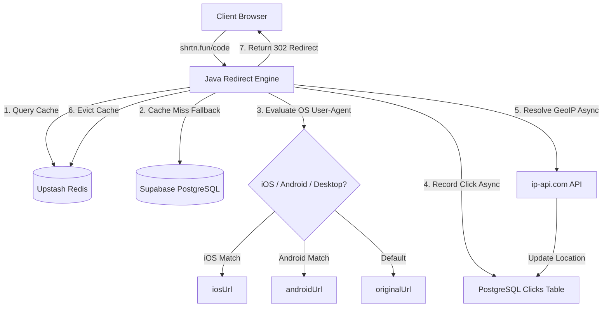

# Shrtn Codebase Architecture & Technical Context

This document captures the complete technical context, architectural flows, database schemas, caching mechanics, and design patterns of the **Shrtn** URL shortener platform.

---

## 1. System Architecture

### 1.1 Redirection Flow & Smart Routing
1. **Public Entry**: Public client redirects hit the backend endpoint `GET /{shortCode}` in `UrlController.java`.
2. **Static & SPA Route Checking**:
   - If the request is for root `/`, serves `static/index.html` (the Landing Page).
   - If the request is for `/signin`, `/signup`, `/dashboard/*`, issues a 302 redirect to `https://app.shrtn.fun/...`.
   - If the request has an extension (e.g. `.svg`, `.png`, `.js`, `.css`), serves the corresponding static resource from `static/` with proper `Content-Type`.
3. **Fast Caching Lookup**: Looks up the key `url:{shortCode}` in Upstash Redis.
4. **Database Fallback**: On a cache miss, queries Supabase PostgreSQL. If the URL exists, is active, and is not expired, it caches the result in Redis for **24 hours**.
5. **Smart Device Routing**: Evaluates the visitor's `User-Agent` string via `ua-parser`:
   - **iOS** (`iPhone`, `iPad`, `iPod`): If `iosUrl` is present, redirects to `iosUrl`.
   - **Android**: If `androidUrl` is present, redirects to `androidUrl`.
   - **Default**: Redirects to `originalUrl`.
6. **User-Agent & Location Logging**: Extracts user agent information, referrer headers, and client IP.
7. **Background Geo-location Resolution**:
   - Checks proxy headers (`CF-IPCountry`, `X-Vercel-IP-Country`, `X-Geo-Country`) for instant country resolution.
   - If missing, launches an asynchronous task (`@Async` thread proxy boundary) to query `http://ip-api.com/json/{ip}?fields=status,country,regionName,city`.
   - **Local Developer/Loopback Geolocation Override**: If the client IP is local (`127.0.0.1`, `localhost`, etc.), it calls the API with no IP path, resolving the location of the host server (e.g., the developer's machine in India).
8. **Postgres Storage**: Inserts record into the `clicks` database table containing `clicked_at`, `ip_address`, `user_agent`, `referrer`, `country`, `region`, and `city`.
9. **Active Cache Invalidation**: Evicts the cached list `urls:{userId}` and the cached analytics data `analytics:{shortCode}` to ensure live updates in the React dashboard.
10. **Deleted / Missing Link Fallback**: If a link is deleted, disabled, or expired, returns a `302 Found` redirect to `/` (the root Landing Page).

---

## 2. Database Schema

The system uses a PostgreSQL database with the following structure:

### `users`
Tracks authenticated dashboard users.
* `id` (bigint, PK)
* `email` (varchar(255), UNIQUE)
* `password` (varchar(255))
* `is_verified` (boolean)

### `urls`
Tracks shortened links created by users (max 25 active links per user).
* `id` (bigint, PK)
* `short_code` (varchar(255), UNIQUE)
* `original_url` (varchar(2048))
* `ios_url` (varchar(2048), NULLABLE) — target link for iOS visitors
* `android_url` (varchar(2048), NULLABLE) — target link for Android visitors
* `created_at` (timestamp)
* `expires_at` (timestamp)
* `is_active` (boolean)
* `has_qr_code` (boolean)
* `password_hash` (varchar(255), NULLABLE)
* `user_id` (bigint, FK → `users.id`)

### `clicks`
Tracks detailed click entries for each shortcode.
* `id` (bigint, PK)
* `clicked_at` (timestamp)
* `ip_address` (varchar(45))
* `user_agent` (varchar(512))
* `referrer` (varchar(255))
* `country` (varchar(100))
* `region` (varchar(100))
* `city` (varchar(100))
* `url_id` (bigint, FK → `urls.id`)

### `otps`
Tracks one-time pins for user signups and password recovery.
* `id` (bigint, PK)
* `otp_code` (varchar(6))
* `purpose` (varchar(255)) — e.g. `EMAIL_VERIFICATION`, `FORGOT_PASSWORD`
* `created_at` (timestamp)
* `expires_at` (timestamp) — expires in **5 minutes** (verification) or **15 minutes** (forgot password)
* `used_at` (timestamp)
* `user_id` (bigint, FK → `users.id`)

---

## 3. Caching Policies (Redis)

To handle high throughput during redirects, Redis holds pre-calculated objects:

| Cache Key | Value Type | Expiration | Invalidation Events |
|---|---|---|---|
| `url:{shortCode}` | Serialized `UrlCacheEntry` (contains `originalUrl`, `iosUrl`, `androidUrl`) | 24 Hours | Link Toggled, Link Deleted, Link Expired |
| `urls:{userId}` | Serialized list of `UrlResponse` DTOs | 30 Seconds | Link Created, Link Toggled, Link Deleted, QR Code Updated |
| `analytics:{shortCode}` | Serialized `UrlAnalyticsResponse` | 24 Hours | New Click Event, Link Deleted |

---

## 4. Frontend Component & Styling Architecture

The client application is built with React 19, TypeScript, Tailwind CSS v4, and Lucide React.

### 4.1 Rounded Corners Design Token
All cards, modals, input containers, and button primitives use reduced rounded corners (**`rounded-lg`**) to maintain a professional, sharp, and uniform aesthetic.

### 4.2 Smart Device Routing Controls
In [`ShortenPage.tsx`](file:///home/charan/Documents/shrtn/client/src/pages/ShortenPage.tsx), users can configure optional iOS and Android destination URLs under *Link Options*. Inputs pass `iosUrl` and `androidUrl` in the `createShortUrl` request payload.

### 4.3 Analytics Cards Layout
The dashboard layout arranges the breakdown metrics into two clean, side-by-side cards inside a responsive grid:

1. **Environment Panel**
   - **Header Title**: "Environment" (normal casing).
   - **Tabs**: `Browsers`, `OS`, and `Devices` rendered under the header line with a bottom blue active indicator bar.
   - **Footer Button**: A centered `More` button featuring a maximize `[ ]` icon to open an expanded table of up to 100 entries.

2. **Location Panel**
   - **Header Title**: "Location" (normal casing).
   - **Tabs**: `Countries`, `Regions`, and `Cities` rendered under the header line with a bottom blue active indicator bar.
   - **Footer Button**: A centered `More` button featuring a maximize `[ ]` icon to open an expanded table of up to 100 entries.

---

## 5. Local Setup Checklist

1. **Backend Server**:
   - Set database, Upstash Redis, and Resend API Key credentials in `/server/.env`.
   - Run `./gradlew bootRun` inside `server/` to boot the server (defaults to port `8080`).
2. **Frontend Client**:
   - Install dependencies using `bun install` inside `client/`.
   - Run `bun run dev` inside `client/` to start the local hot-reloaded development environment (defaults to port `5173`).
   - Run `bun run build` to package the production-ready build output into `client/dist/`.
