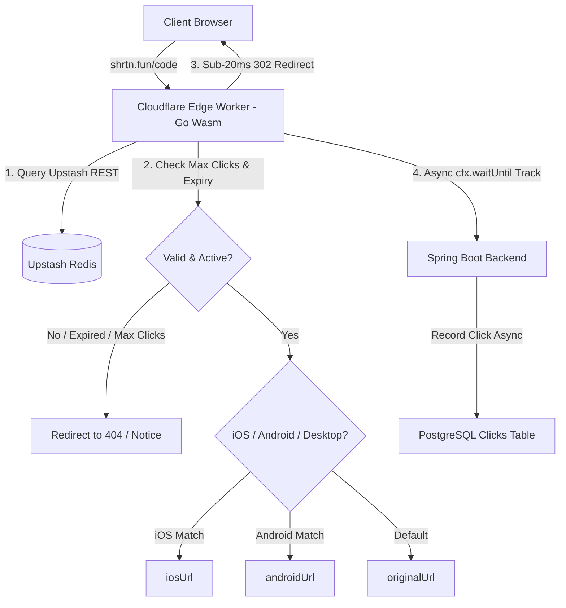

# Shrtn Codebase Architecture & Technical Context

This document captures the technical context, architectural flows, database schemas, caching mechanics, and design patterns of the **Shrtn** platform.

---

## 1. System Architecture

### 1.1 Redirection Flow & Smart Routing
1. **Public Edge Entry**: Public client redirects hit Cloudflare Edge Isolates running Go WebAssembly (`main.wasm`).
2. **Static & Auth Route Delegation**:
   - `/` $\rightarrow$ Serves Landing Page with Edge Caching (`caches.default`).
   - `/signin`, `/signup`, `/dashboard/*` $\rightarrow$ Issues instant 302 redirects to `https://app.shrtn.fun/...`.
3. **Upstash Redis REST Querying**: Queries Upstash Redis REST endpoint (`/get/url:{shortCode}`).
4. **Auto-Destruct & Password Checking**:
   - If `maxClicks` is reached or `isActive` is `false`, returns deactivation notice.
   - If `isPasswordProtected` is `true`, redirects visitor to password unlock screen (`/unlock/{shortCode}`).
5. **Smart Device Routing**: Evaluates `User-Agent` header in Go Wasm:
   - **iOS** (`iPhone`, `iPad`, `iPod`): Redirects to `iosUrl` if set.
   - **Android**: Redirects to `androidUrl` if set.
   - **Default**: Redirects to `originalUrl`.
6. **Non-Blocking Async Click Tracking**: Dispatches background `ctx.waitUntil(fetch("/api/v1/clicks/track"))` call to Spring Boot API. Records click entries (`clicked_at`, `ip_address`, `user_agent`, `country`, `region`, `city`) in PostgreSQL without impacting sub-20ms redirect speed.

---

## 2. Database Schema

### `urls` Table
* `id` (bigint, PK)
* `short_code` (varchar(255), UNIQUE)
* `original_url` (varchar(2048))
* `ios_url` (varchar(2048), NULLABLE)
* `android_url` (varchar(2048), NULLABLE)
* `max_clicks` (integer, NULLABLE) — **Auto-Destruct limit**
* `created_at` (timestamp)
* `expires_at` (timestamp)
* `is_active` (boolean)
* `password_hash` (varchar(255), NULLABLE)
* `user_id` (bigint, FK → `users.id`)

### `clicks` Table
* `id` (bigint, PK)
* `url_id` (bigint, FK → `urls.id`)
* `clicked_at` (timestamp)
* `ip_address` (varchar(255))
* `user_agent` (varchar(1024))
* `referrer` (varchar(1024))
* `country` (varchar(255))
* `region` (varchar(255))
* `city` (varchar(255))

---

## 3. Cloudflare Worker Edge Engine (`cloudflare-worker/`)

- **Language**: Go (Golang) 1.22
- **Compilation**: `GOOS=js GOARCH=wasm go build -ldflags="-s -w" -o main.wasm main.go`
- **Bridge**: `index.js` instantiates `WebAssembly.instantiate(wasmModule, go.importObject)` and executes `globalThis.handleGoRedirect(...)`.
- **Edge Cache**: `/assets/*` static files cached using `caches.default` (`max-age=31536000`) to prevent Render 502 Bad Gateways.
- **Latency**: Sub-20ms 302 redirects at Cloudflare's 300+ Edge locations.
