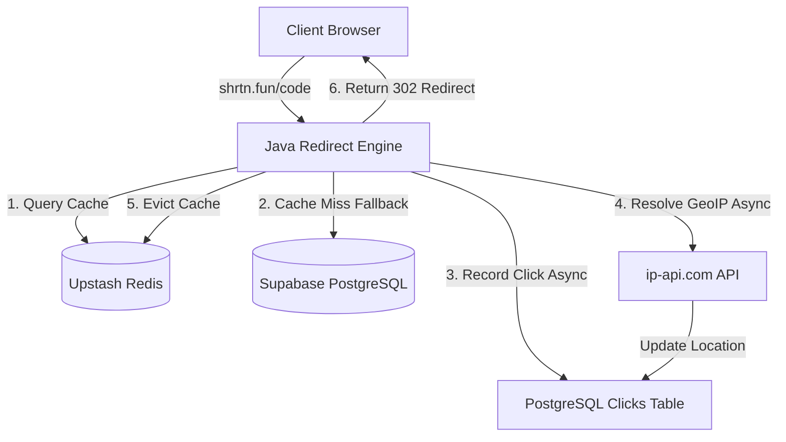

# Shrtn Codebase Architecture & Technical Context

This document captures the complete technical context, architectural flows, database schemas, caching mechanics, and design patterns of the **Shrtn** URL shortener platform.

---

## 1. System Architecture

### 1.1 Redirection Flow
1. **Public Entry**: Public client redirects hit the backend endpoint `GET /{shortCode}` in `UrlController.java`.
2. **Fast Caching Lookup**: Looks up the key `url:{shortCode}` in Upstash Redis.
3. **Database Fallback**: On a cache miss, queries Supabase PostgreSQL. If the URL exists, is active, and is not expired, it caches the result in Redis for **24 hours**.
4. **User-Agent & Location Logging**: Extracts user agent information, referrer headers, and client IP.
5. **Background Geo-location Resolution**:
   - Checks proxy headers (`CF-IPCountry`, `X-Vercel-IP-Country`, `X-Geo-Country`) for instant country resolution.
   - If missing, launches an asynchronous task (`@Async` thread proxy boundary) to query `http://ip-api.com/json/{ip}?fields=status,country,regionName,city`.
   - **Local Developer/Loopback Geolocation Override**: If the client IP is local (`127.0.0.1`, `localhost`, etc.), it calls the API with no IP path, resolving the location of the host server (e.g., the developer's machine in India) rather than returning mock dummy data.
6. **Postgres Storage**: Inserts record into the `clicks` database table containing `clicked_at`, `ip_address`, `user_agent`, `referrer`, `country`, `region`, and `city`.
7. **Active Cache Invalidation**: Evicts the cached list `urls:{userId}` and the cached analytics data `analytics:{shortCode}` to ensure live updates in the React dashboard.
8. **302 Redirect**: Issues a HTTP 302 redirect to the destination URL.

---

## 2. Database Schema

The system uses a PostgreSQL database with the following structure:

### `users`
Tracks authenticated dashboard users.
* `id` (bigint, PK)
* `email` (varchar(255), UNIQUE)
* `password` (varchar(255))
* `is_verified` (boolean)

### `urls`
Tracks shortened links created by users (max 25 active links per user).
* `id` (bigint, PK)
* `short_code` (varchar(255), UNIQUE)
* `original_url` (varchar(2048))
* `created_at` (timestamp)
* `expires_at` (timestamp)
* `is_active` (boolean)
* `has_qr_code` (boolean)
* `user_id` (bigint, FK → `users.id`)

### `clicks`
Tracks detailed click entries for each shortcode.
* `id` (bigint, PK)
* `clicked_at` (timestamp)
* `ip_address` (varchar(45))
* `user_agent` (varchar(512))
* `referrer` (varchar(255))
* `country` (varchar(100))
* `region` (varchar(100))
* `city` (varchar(100))
* `url_id` (bigint, FK → `urls.id`)

### `otps`
Tracks one-time pins for user signups and password recovery.
* `id` (bigint, PK)
* `otp_code` (varchar(6))
* `purpose` (varchar(255)) — e.g. `EMAIL_VERIFICATION`, `FORGOT_PASSWORD`
* `created_at` (timestamp)
* `expires_at` (timestamp) — expires in **5 minutes** (verification) or **15 minutes** (forgot password)
* `used_at` (timestamp)
* `user_id` (bigint, FK → `users.id`)

---

## 3. Caching Policies (Redis)

To handle high throughput during redirects, Redis holds pre-calculated objects:

| Cache Key | Value Type | Expiration | Invalidation Events |
|---|---|---|---|
| `url:{shortCode}` | Serialized `UrlCacheEntry` | 24 Hours | Link Toggled, Link Deleted, Link Expired |
| `urls:{userId}` | Serialized list of `UrlResponse` DTOs | 30 Seconds | Link Created, Link Toggled, Link Deleted, QR Code Updated |
| `analytics:{shortCode}` | Serialized `UrlAnalyticsResponse` | 24 Hours | New Click Event, Link Deleted |

---

## 4. Frontend Component & Styling Architecture

The client application is built with React 19, TypeScript, Tailwind CSS v4, and Lucide React.

### 4.1 Rounded Corners Design Token
All cards, modals, input containers, and button primitives use reduced rounded corners (**`rounded-lg`**) to maintain a professional, sharp, and uniform aesthetic.

### 4.2 Analytics Cards Layout
The dashboard layout arranges the breakdown metrics into two clean, side-by-side cards inside a responsive grid:

1. **Environment Panel**
   - **Header Title**: "Environment" (normal casing).
   - **Tabs**: `Browsers`, `OS`, and `Devices` rendered under the header line with a bottom blue active indicator bar.
   - **Footer Button**: A centered `More` button featuring a maximize `[ ]` icon to open an expanded table of up to 100 entries.

2. **Location Panel**
   - **Header Title**: "Location" (normal casing).
   - **Tabs**: `Countries`, `Regions`, and `Cities` rendered under the header line with a bottom blue active indicator bar.
   - **Footer Button**: A centered `More` button featuring a maximize `[ ]` icon to open an expanded table of up to 100 entries.

### 4.3 Breakdown Tables Layout
Each list inside a breakdown card is built with the `BreakdownTable` component:
* **Table Headers**: Underneath the tab row, column headers are rendered:
  - Left column: Dynamic label matching the active tab (e.g. `Browser`, `OS`, `Device`, `Country`, `Region`, `City`).
  - Right column: `Visitors`.
* **Value Display & Pipe Separator**: Row counts and percentages are right-aligned and separated by a clean vertical pipe border (e.g., `10 | 67%`).
* **Flags Integration**: Uses the `flag-icons` npm package.
  - Countries render their corresponding flag span directly.
  - **Regions & Cities Flags**: Keys are formatted as `Name:Country` in the backend payload. The frontend splits the key (`name.split(":")`), displays the regional/city name, and looks up the parent country code to display the correct flag icon instead of a generic letter avatar.

---

## 5. Local Setup Checklist

1. **Backend Server**:
   - Set database, Upstash Redis, and Resend API Key credentials in `/server/.env`.
   - Run `./gradlew bootRun` inside `server/` to boot the server (defaults to port `8080`).
2. **Frontend Client**:
   - Install dependencies using `bun install` inside `client/`.
   - Run `bun run dev` inside `client/` to start the local hot-reloaded development environment (defaults to port `5173`).
   - Run `bun run build` to package the production-ready build output into `client/dist/`.

---

## 6. Developer Guidelines for Future Modifications

When extending or maintaining this codebase, future developers and agent pairs must strictly adhere to the following architectural patterns and rules:

### 6.1 UTC Timestamp Parsing in Frontend
The Java backend serializes database timestamps (which are in UTC) as ISO Local Date-Time strings (e.g. `"2026-08-30T10:42:27.736927"`). 
* **The Rule**: Never parse dates directly using `new Date(value)` in UI components.
* **The Solution**: Always pass raw timestamps through the `safeDate` helper in [`client/src/lib/url.ts`](file:///home/charan/Documents/shrtn/client/src/lib/url.ts). It detects missing timezone specifiers and appends `"Z"`, ensuring the browser correctly parses the date in UTC and formats it in the user's local timezone (e.g. converting `10:42 AM UTC` to `4:12 PM IST`).

### 6.2 Heatmap Timezone Alignment
The `TrafficActivity` heatmap is aggregated server-side into a 7x24 grid based on UTC hours.
* **The Rule**: Timezone shifts must occur in the frontend at **minute-level granularity** (not by shifting index integers directly).
* **The Solution**: In [`AnalyticsPage.tsx`](file:///home/charan/Documents/shrtn/client/src/pages/AnalyticsPage.tsx), convert the day-and-hour grid coordinates to absolute weekly minutes (using the middle of the hour `30` mins to prevent rounding limits), apply the offset `Date.prototype.getTimezoneOffset()`, wrap it around the `10080` minutes of a 7-day week cycle, and reconstruct the local day and hour indices. This ensures fractional timezone offsets (like India's `+5:30`) map clicks to the correct local hour slot (e.g. `4 PM`) rather than rounding down (e.g. `3 PM`).

### 6.3 User Agent Parsing Priority
Android user agents contain both `"Linux"` and `"Android"`, and iOS user agents contain both `"Mac OS"` and `"iPhone/iPad"`.
* **The Rule**: Check for specific mobile operating systems (Android, iOS) and distributions (ChromeOS, Ubuntu) **before** falling back to generic kernel signatures (Linux, macOS).
* **The Solution**: In [`icons.ts`](file:///home/charan/Documents/shrtn/client/src/lib/icons.ts), the helper `getOsIcon` evaluates specific mobile/distro tokens first to prevent mobile devices from showing up as generic Linux/macOS desktops.

### 6.4 Offline-First Brand and Device Assets
* **The Rule**: Do not rely on external CDN queries for core browser, OS, and device logos.
* **The Solution**: All icons used in the dashboard breakdowns are served locally from `/icons/` (mapped to `client/public/icons/`). Add new SVG assets to this folder and update [`icons.ts`](file:///home/charan/Documents/shrtn/client/src/lib/icons.ts) rather than using external paths.

### 6.5 Dicebear Notionists Avatars
The visitor log in the recent clicks card renders human vector avatars.
* **The Rule**: Avoid using static indices (`1`, `2`, `3`) or rendering blank icons.
* **The Solution**: Generate a Notionists avatar on the fly using `@dicebear/core` and `@dicebear/styles`. Always pass the visitor's IP address (`click.ipAddress`) as the `seed` parameter so that returning visitors retain their unique avatar signature across refresh cycles.

